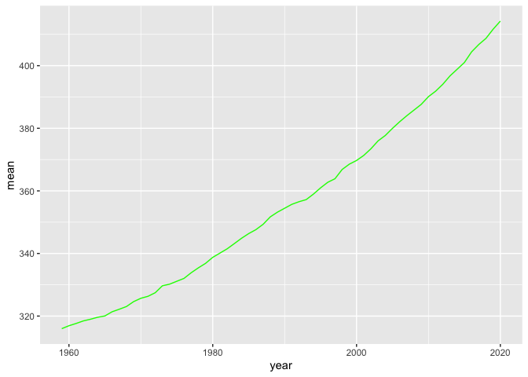

Case Study 08
================
Alex Gould
October 26, 2021

``` r
library(tidyverse)

URL <- "https://gml.noaa.gov/webdata/ccgg/trends/co2/co2_annmean_mlo.txt"
Data <- read_table(URL, skip = 57, col_names =c("year", "mean", "unc"))
```

    ## 
    ## ── Column specification ────────────────────────────────────────────────────────
    ## cols(
    ##   year = col_double(),
    ##   mean = col_double(),
    ##   unc = col_double()
    ## )

``` r
ggplot(data=Data, mapping=aes(x=year, y=mean))+
  geom_line(color= "green")
```

<!-- -->

``` r
Top5 <- Data %>%
  arrange(desc(mean)) %>%
  top_n(mean, n=5)

knitr::kable(Top5)
```

| year |   mean |  unc |
|-----:|-------:|-----:|
| 2020 | 414.24 | 0.12 |
| 2019 | 411.66 | 0.12 |
| 2018 | 408.72 | 0.12 |
| 2017 | 406.76 | 0.12 |
| 2016 | 404.41 | 0.12 |

``` r
#run rmarkdown::render("week_08/case_study_08.Rmd", output_format = "all") below 
```
