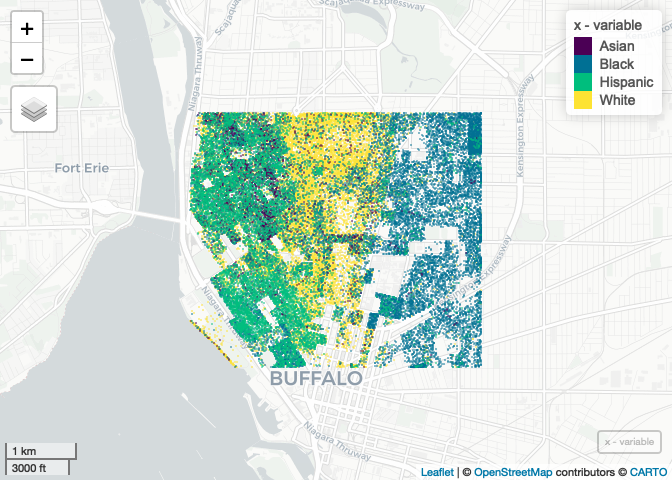

Case Study 11
================
Alex Gould
November 16, 2021

Load Packages

``` r
library(tidyverse)
```

    ## ── Attaching packages ─────────────────────────────────────── tidyverse 1.3.1 ──

    ## ✓ ggplot2 3.3.5     ✓ purrr   0.3.4
    ## ✓ tibble  3.1.4     ✓ dplyr   1.0.7
    ## ✓ tidyr   1.1.3     ✓ stringr 1.4.0
    ## ✓ readr   2.0.1     ✓ forcats 0.5.1

    ## ── Conflicts ────────────────────────────────────────── tidyverse_conflicts() ──
    ## x dplyr::filter() masks stats::filter()
    ## x dplyr::lag()    masks stats::lag()

``` r
library(spData)
```

    ## To access larger datasets in this package, install the spDataLarge
    ## package with: `install.packages('spDataLarge',
    ## repos='https://nowosad.github.io/drat/', type='source')`

``` r
library(sf)
```

    ## Linking to GEOS 3.8.1, GDAL 3.2.1, PROJ 7.2.1

``` r
library(mapview) 
library(foreach)
```

    ## 
    ## Attaching package: 'foreach'

    ## The following objects are masked from 'package:purrr':
    ## 
    ##     accumulate, when

``` r
library(doParallel)
```

    ## Loading required package: iterators

    ## Loading required package: parallel

``` r
library(raster)
```

    ## Loading required package: sp

    ## 
    ## Attaching package: 'raster'

    ## The following object is masked from 'package:dplyr':
    ## 
    ##     select

``` r
registerDoParallel(4)
getDoParWorkers() 
```

    ## [1] 4

Load Census Key and Data

``` r
library(tidycensus)
census_api_key("010fd09f09be4dc9cf4d3f416f521716553b782c", install=TRUE, overwrite=TRUE)
```

    ## Your original .Renviron will be backed up and stored in your R HOME directory if needed.

    ## Your API key has been stored in your .Renviron and can be accessed by Sys.getenv("CENSUS_API_KEY"). 
    ## To use now, restart R or run `readRenviron("~/.Renviron")`

    ## [1] "010fd09f09be4dc9cf4d3f416f521716553b782c"

Buffalo Demographics

``` r
library(tidycensus)
racevars <- c(White = "P005003", 
              Black = "P005004", 
              Asian = "P005006", 
              Hispanic = "P004003")

options(tigris_use_cache = TRUE)

erie <- get_decennial(geography = "block", variables = racevars, 
                  state = "NY", county = "Erie County", geometry = TRUE,
                  summary_var = "P001001", cache_table=T)
```

    ## Getting data from the 2010 decennial Census

    ## Using Census Summary File 1

Crop to County

``` r
county <- st_crop(erie, xmin=-78.9,xmax=-78.85,ymin=42.888,ymax=42.92)
```

    ## Warning: attribute variables are assumed to be spatially constant throughout all
    ## geometries

Foreach

``` r
x <- foreach(i=unique(county$variable),.combine='rbind') %dopar% 
  {
     county %>%
     filter(variable == i) %>%
     st_sample(size=.$value) %>%
      st_as_sf() %>%
      mutate(variable=i)
  }
```

Map

``` r
mapview(x, zcol = "variable", cex = 0.01, alpha = 0)
```

<!-- -->
